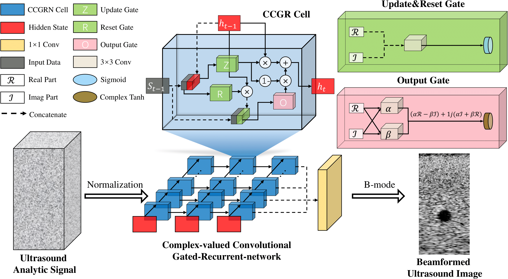

# CCGR
### [Paper](https://ieeexplore.ieee.org/document/10496192) | [Project Page](https://github.com/zhangzm0128/CCGR) 

> CCGR: Complex-valued Convolutional Gated Recurrent Neural Network for Ultrasound Beamforming

> [Zhiming Zhang](https://zhangzm0128.github.io/), Zhenyu Lei, MengChu Zhou, Hideyuki Hasegawa, [Shangce Gao](https://toyamaailab.github.io/)

CCGR is a Complex-valued Convolutional Gated Recurrent neural network for beamforming complex-valued ultrasound analytic signals with spatio-temporal features. Our experimental results reveal its outstanding imaging quality over existing state-of-the-art methods. More significantly, its ultrafast processing speed of only 0.07s per image promises its considerable clinical application potential.

## Key Features


- **Complex-Valued Operations**: CCGR utilizes complex-valued convolutional gates to process ultrasound analytic signals effectively.
- **Enhanced Accuracy**: Compared to traditional methods, CCGR offers superior beamforming accuracy, ensuring high-quality imaging results.
- **Deep Integration**: The seamless integration of convolution and recurrent neural network architectures enhances feature extraction and signal processing capabilities.
- **Ultrafast Processing**: With an impressive processing speed of only 0.07s per image, CCGR holds promise for rapid clinical applications.

# Getting Started

### Training
Train the DVT on Nvidia GPU.
```
python main.py --mode train --device cuda --config ./config.json
```
### Prediction
Test a model on Nvidia GPU.
```
python main.py --mode predict --device cuda --checkpoint ./logs/xxx
```
## Citing CCGR

Zhiming Zhang, Zhenyu Lei, MengChu Zhou, Hideyuki Hasegawa, and Shangce Gao, “Complex-valued Convolutional Gated Recurrent Neural Network for Ultrasound Beamforming,” IEEE Transactions on Neural Networks and Learning Systems, 2024. DOI: 10.1109/TNNLS.2024.3384314. 


```bib
@article{zhang2024complex,
  author={Zhiming Zhang,Zhenyu Lei,MengChu Zhou,Hideyuki Hasegawa,Shangce Gao},
  title={Complex-valued Convolutional Gated Recurrent Neural Network for Ultrasound Beamforming},
  journal={IEEE Transactions on Neural Networks and Learning Systems},  
  year={2024},
  doi={10.1109/TNNLS.2024.3384314}
}
